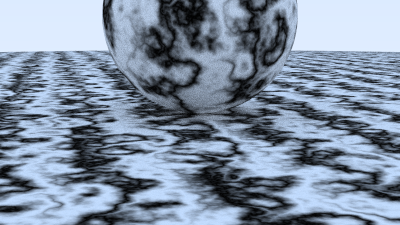

# 🦀 Ray Tracer

[](https://opensource.org/licenses/MIT)
[](https://www.rust-lang.org/)

<div align="center">
    
</div>

## 🌟 Features and Example Renders
<div style="text-align: center;">
    <table style="margin-left: auto; margin-right: auto;">
    <tr>
        <td><br/><strong>Depth of Field:</strong> Simulates camera lens focus and defocus blur.</td>
        <td><br/><strong>Motion Blur:</strong> Represents motion of objects moving over time.</td>
    </tr>
    <tr>
        <td><br/> <strong>Image Textures:</strong> Maps images as textures onto shapes in the scene.</td>
        <td><br/> <strong>Perlin Noise:</strong> Generates random textures with organic appearance.</td>
    </tr>
    </table>
</div>

### Other Features
- **Antialiasing:** Smooths out jagged edges by casting multiple rays per pixel.
- **Reflections and Shadows:** Simulates the behavior of light by calculating when light bounces off reflective objects or is blocked by an object.
- **Configurable Camera:** Allows adjustment of the camera's position, orientation, lens, and field of view to capture various types of shots. 
- **Various Materials:** Use different materials including shiny metals, diffuse Lambertian surfaces, or glass-like objects that handle light reflection and refraction.


## ℹ️ Overview

This is a simple ray tracer written in Rust guided by the implementation of the ["Ray Tracing in One Weekend"](https://raytracing.github.io/) series by Peter Shirley. I developed an interest in computer graphics early on in my computer science coursework in school, so this project is a way to explore that interest while also learning some Rust along the way! The goal of the ray tracer is to render realistic looking images that imitate the way light interacts with various complex surfaces and textures. Above are example renders that demonstrate what the ray tracer is currently capable of.


### ✍️ Authors

#### [Alex Stern](https://github.com/alexmstern) 
I am currently a senior studying math and computer science at UChicago, and I am interested in pursuing a career in  software engineering and technology more broadly. Feel free to message me via [LinkedIn](https://www.linkedin.com/in/alexmstern/)!


## ⬇️ Installation

Simply clone the repository and load the necessary Rust packages to begin working with the project:

```bash
git clone https://github.com/alexmstern/ray-tracer.git
cd ray-tracer
cargo build
```


## 🚀 Usage

You can render different scenes by changing the `scene` variable in `main.rs` to the corresponding scene in the `scenes` folder. Play around with the settings to get a sense for how the different variables affect the scene and feel free to create your own scenes! Once you have done that render your image with the following commands:
```bash
cargo build
cargo run
```