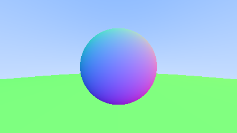

# Ray Tracer

    
    
A sphere colored according to its normal vectors.

This is an implementation of a simple ray tracer following [Ray Tracing in One Weekend](https://raytracing.github.io/), written in Rust.